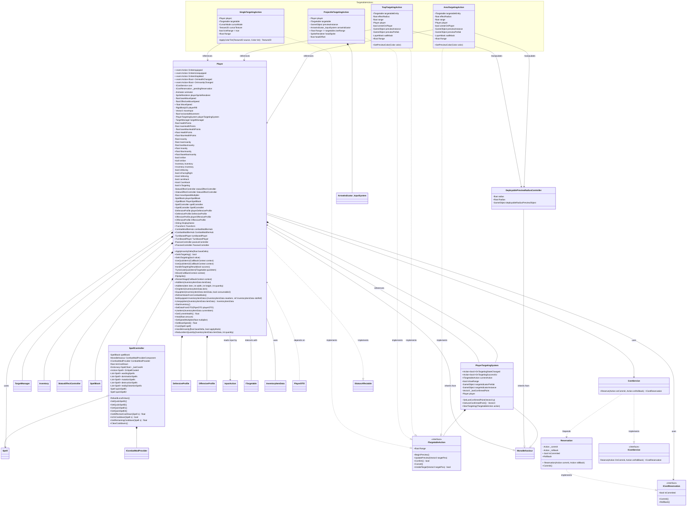

```mermaid
classDiagram

class DefensiveSnapshot{
<<struct>>
+float dodge01
+Dictionary~DamageType,float~ SpecificRes01
+Dictionary~DamageType,float~ GeneralRes01
+GetRes(DamageType t) float
+GetRes(DamageCategory c) float
+CreateDefaults()$
}

DefensiveProfile --|> MonoBehaviour

class DefensiveProfile{
+uint version
+event Action OnChanged
+float dodgeChance
+List~SpecDamageResEntry~ specificDamageResistances
+List~GenDamageResEntry~ generalDamageResistances
+GetResistance(DamageType type) float
+GetResistence(DamageCategory category) float
+GetResistence(String categoryName) float
+SetResistance(DamageType type, int amountPct, bool immune)
+SetResistance(DamageCategory category, int amountPct, bool immune)
+Merge(DefenseStats)
+Unmerge(DefenseStats)
+Merge(DefensiveProfile)
+Unmerge(DefensiveProfile)
+GetSnapshot() DefensiveSnapshot
+InitFromDTO(DefensiveProfileDTO)
+ToDTO() DefensiveProfileDTO

-Touch()
}

DefensiveProfile <-- DefensiveSnapshot : is built based on
DefensiveProfileDTO ..> DefensiveProfile

class SpecPenEntry{
<<struct>>
+DamageType Type
+float amountPct
}

class GenPenEntry{
<<struct>>
+DamageCategory category
+float amountPct
}

class PenetrationSet{
<<struct>>
+float GeneralPct
+float SpecificPct
	+PenetrationSet(float t, float c)
}

class OffensiveSnapshot{
<<struct>>
 +float accuracy01
 +float critChance01
 +CritDamageMultiplier01 
}

class OffensiveProfile{
+uint version
+event Action Onchanged
+float baseAccuracyPct
+float baseCritChancePct
+float baseCritDamageBonusPct
+float maxAccuracyPct
+float maxCritChancePct
%% penetration

+List~GenPenEntry~ generalPenetrations
+List~SpecPenEntry~ specificPenetrations

%% Methods
%% Leitura
+GetSnapshot():OffensiveSnapshot
+GetPenetrationFor(DamageType damageType, DamageTypeMap map, out float penGeneralPct, out float penSpecPct)
+GetPenetrationSet(DamageType t, DamageTypeMap map) PenetrationSet
%% Escrita
+SetSpecificPenetration(DamageType type, int ammountPct)
+SetGeneralPenetration(DamageCategory category, int ammountPct)
+ApplyState(OffensiveState state)
+InitiFromDTO(OffensiveProfileDTO dto)
+ToDTO() OffensiveProfileDTO
}

class OffensiveState{
+float Accuracy01
+float CritChance01
+float CrtiDamage01
-Dictionary~DamageCategory, float~ generalPenetrations
-Dictionary~DamageType, float~ specificPenetrations
+OffensiveState()
+OffensiveState(OffensiveProfile profile)
+Defaults() OffensiveState
%% Leitura
+GetGeneralPenetration(DamageCategory category) float
+GetSpecificPenetration(DamageType type) float
+ToOffensiveSnapshot() OffensiveSnapshot
}

OffensiveProfile o-- SpecPenEntry
OffensiveProfile o-- GenPenEntry
OffensiveProfile --> PenetrationSet:Generates
OffensiveProfile --> OffensiveSnapshot: Generates
OffensiveProfile <.. OffensiveProfileDTO
OffensiveProfile --> OffensiveState:Generates
OffensiveState --> OffensiveSnapshot:Generates

class IProfileProvider{
<<Interface>>
}
IProfileProvider *-- DefensiveProfile
IProfileProvider *-- OffensiveProfile

```

```mermaid

classDiagram

class Player{
+ event Action OnItemquipped
+ event Action OnItemUnequipped
+ event Action OnItemDepleted
+ event Action~float~ OnHealthChanged
+ event Action~float~ OnInsanityChanged
- ICostService cost
- ICostReservation _pendingReservation
- Animator animator
- SpriteRenderer playerSpriteRenderer
- float baseMoveSpeed
- float EffectiveMoveSpeed
+ float MoveSpeed
- RigidBody2D playerRB
- Vector2 moveInput
- float horizontalMovement
- PlayerTargetingSystem playerTargetingSystem
-  TargetManager targetManager
-float healthPoints
-float maxHealthPoints
- float baseMaxHealthPoints
+float HealthPoints
+float MaxHealthPoints
-float insanity
-float maxInsanity
-float basMaxInsanity
+float Insanity
+float MaxInsanity
+float BaseMaxInsanity
-bool isAlive
+boll IsAlive
-Inventory inventory
+Inventory Inventory
-bool isMoving
-bool isFacingRight
+bool IsMoving
-bool canAttack
+bool CanAttack
-bool isTargeting
-StatusEffectController statusEffectController
+StatusEffectController StatusEffectController
-float moveSpeedMultiplier
%% SpellBook Related
-SpellBook playerSpellBook
+SpellBook PlayerSpellBook
-SpellController spellController
+SpellController SpellController

%% Insanity Related

+ApplyInsanityDelta(float baseDelta)
-DefensiveProfile playerDefensiveProfile
+DefensiveProfile DefensiveProfile
-OffensiveProfile playerOffensiveProfile
+OffensiveProfile OffensiveProfile
+String DisplayName
+Transform Transform
-CombatModifierHub combatModifierHub 
+CombatModifierHub CombatModifierHub
%%Turn Based Player
-TurnBasedPlayer turnBasedPlayer
+TurnBasedPlayer TurnBasedPlayer

%% Passives 
-PassiveController passiveController
+PassiveController PassiveController

%% Member Methods
+GetIsTargeting() bool
+SetIsTargeting(bool value)
-UseQuickItem1(CallBackContext context)
-UseQuickItem2(CallBackContext context)
-HandleTargetingResult(bool success)
-TryActivateQuickItem(ITargetable quickItem)
+Move(CallBackContext context)
-FlipSprite()
%% Temporário
+RestartStage(CallbackContext context)
+AddItem(InventoryItemData itemData)
+AddItem(Item item, int width, int height, int quantity)
+DropItem(InventoryItemData item)
+EquipItem(InventoryItemData itemData, bool consumable2)
+RefreshStatsFromCombatMods()
-SetEquipped~InventoryItemData~(InventoryItemData newItem, ref InventoryItemData slotRef)
+UnequipItem(InventoryItemData itemData) InventoryItemData
+StartInventory()
+SetDataFromDTO(PlyerDTO playerDTO)
+UseItem(InventoryItemData currentItem)
+GetCurrentHealth() float
+Heal(float amount)
+SetSpeedMultiplier(float multiplier)
+GetBaseSpeed() float
+Cast(Spell spell)
+HandleInsanity(float baseDelta, bool applyMods)
+ReduceItemQuantity(InventoryItemData itemData, int quantity)

}

Player --> ICostReservation: uses
Player *-- PlayerTargetingSystem
Player *-- TargetManager
Player *-- Inventory
Player *-- StatusEffectController
Player *-- SpellBook
Player *-- SpellController
Player *-- DefensiveProfile
Player *-- OffensiveProfile
Player --> InputAction: reads input by
Player -- ITargetable : interacts with
Player -- InventoryItemData : uses
Player <.. PlayerDTO :depends on
Player --> Spell: casts

class SpellController{
-SpellBook spellBook
-MonoBehaviour CombatModProviderComponent
-ICombatModProvider CombatModProvider
-float minCoolDown
-Dictionary~Spell,float~ _lastCastAt
+Action~Spell~ OnSpellCasted
-List~Spell~ wardingSpells
-List~Spell~ dominationSpells
-List~Spell~ mutationSpells
-List~Spell~ destructionSpells
-List~Spell~ realityDistortionSpells
-Spell quickSpell1
-Spell quickSpell2
-RebuildLocalViews()
+SetQuickSpell1()
+SetQuickSpell2()
+GetQuickSpell1()
+GetQuickSpell2()
+GetEffectiveCoolDown(Spell s) float
+IsOnCooldown(Spell s) bool
+GetRemainingCooldown(Spell s) float
+ClearCooldowns()
}

SpellController *-- ICombatModProvider
SpellController o-- Spell

class PlayerTargetingSystem{
+Action~bool~OnTargetingStateChanged
+Action~bool~OnTargetingSuccessful
+ITargetableAction currentAction
+bool showRange
-GameObject rangeIndicatorPrefab
-GameObject rangeIndicatorInstance
-Vector3 _lastConfirmedPoint
~SetLastConfirmedPoint(Vector3 p)
+GetLestConfirmedPoint() Vector3
-Player player
+StartTargeting(ITargetableAction action)
}

PlayerTargetingSystem *-- ITargetableAction
PlayerTargetingSystem --|> MonoBehaviour
PlayerTargetingSystem --> Player: references

class ITargetableAction{
<<interface>>
+float Range
+BeginPreview()
+UpdatePreview(Vector2 targetPos)
+Confirm() bool
+Cancel()
+IsValidTarget(Vector2 targetPos) bool
}

namespace TargetableActions{

	class AreaTargetingAction{
	-ITargetable targetableEntity
	-float effectRadius
	-float range
	-Player player
	-bool centerOnPlayer
	-GameObject previewInstance
	-GameObject previewPrefab
	-LayerMask wallMask
	+float Range
	+SetPreviewColor(Color color)
	}
	
	class ProjectileTargetingAction{
	- Player player
	- ITargetable targetable
	- GameObject previewInstance
	- ArrowIndicator_InputSystem arrowIndicator
	+ float Range => targetable.UseRange
	- SpriteRenderer headSprite
	- float headOffset  
	}
	

	class SingleTargetingAction{
	-Player player;
    -ITargetable targetable
    -CursorMode cursorMode
    -Texture2D cursorTexture
    -bool isInRange = true
	+float Range
	-ApplyColorTint(Texture2D source, Color tint) Texture2D		
	}
	class TrapTargetingAction{
	-ITargetable targetableEntity
	-float effectRadius
	-float range
	-Player player
	-bool centerOnPlayer
	-GameObject previewInstance
	-GameObject previewPrefab
	-LayerMask wallMask
	+float Range
	+SetPreviewColor(Color color)
	}
}

class DeployablePreviewRadiusController{
-float radius
+float Radius
-GameObject deployableRadiusPreviewObject
}

AreaTargetingAction --> Player: references
AreaTargetingAction ..|> ITargetableAction:implements
AreaTargetingAction --> DeployablePreviewRadiusController: manipulates
TrapTargetingAction --> Player: references
TrapTargetingAction ..|> ITargetableAction:implements
TrapTargetingAction --> DeployablePreviewRadiusController: manipulates
ProjectileTargetingAction *--ArrowIndicator_InputSystem
ProjectileTargetingAction..|> ITargetableAction:implements
SingleTargetingAction --> Player: references
SingleTargetingAction ..|> ITargetableAction:implements
DeployablePreviewRadiusController --|> MonoBehaviour: inherits from


class CostService{
+Reserve(Action onCommit, Action onRollback) ICostReservation
}

class Reservation{
- Action _commit
- Action _rollback
+ bool IsCommited
+ Reservation(Action commit, Action rollBack)
  +Commit()
  +Rollback

}

CostService ..> Reservation: Depends
Reservation ..|> ICostReservation : implements

class ICostReservation{
<<Interface>>
+bool IsCommited
+Commit()
+RollBack()
}

Player --|> MonoBehaviour : inherits from
Player ..|> IStatusAffectable: Implements
Player --> CostService: uses
CostService ..|> ICostService: Implements

class ICostService{
<<interface>>

Reserve(Action OnCommit, Action onRollBack) ICostReservation
}

```
