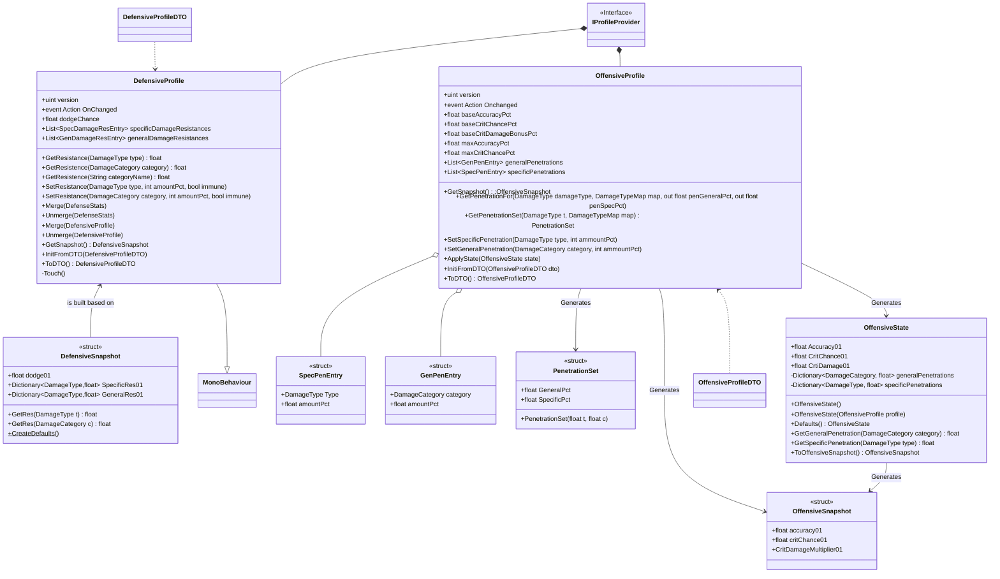
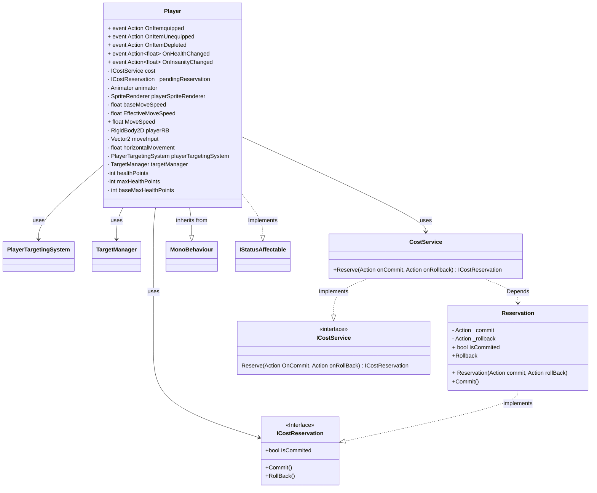

```mermaid
classDiagram

class DefensiveSnapshot{
<<struct>>
+float dodge01
+Dictionary~DamageType,float~ SpecificRes01
+Dictionary~DamageType,float~ GeneralRes01
+GetRes(DamageType t) float
+GetRes(DamageCategory c) float
+CreateDefaults()$
}

DefensiveProfile --|> MonoBehaviour

class DefensiveProfile{
+uint version
+event Action OnChanged
+float dodgeChance
+List~SpecDamageResEntry~ specificDamageResistances
+List~GenDamageResEntry~ generalDamageResistances
+GetResistance(DamageType type) float
+GetResistence(DamageCategory category) float
+GetResistence(String categoryName) float
+SetResistance(DamageType type, int amountPct, bool immune)
+SetResistance(DamageCategory category, int amountPct, bool immune)
+Merge(DefenseStats)
+Unmerge(DefenseStats)
+Merge(DefensiveProfile)
+Unmerge(DefensiveProfile)
+GetSnapshot() DefensiveSnapshot
+InitFromDTO(DefensiveProfileDTO)
+ToDTO() DefensiveProfileDTO

-Touch()
}

DefensiveProfile <-- DefensiveSnapshot : is built based on
DefensiveProfileDTO ..> DefensiveProfile

class SpecPenEntry{
<<struct>>
+DamageType Type
+float amountPct
}

class GenPenEntry{
<<struct>>
+DamageCategory category
+float amountPct
}

class PenetrationSet{
<<struct>>
+float GeneralPct
+float SpecificPct
	+PenetrationSet(float t, float c)
}

class OffensiveSnapshot{
<<struct>>
 +float accuracy01
 +float critChance01
 +CritDamageMultiplier01 
}

class OffensiveProfile{
+uint version
+event Action Onchanged
+float baseAccuracyPct
+float baseCritChancePct
+float baseCritDamageBonusPct
+float maxAccuracyPct
+float maxCritChancePct
%% penetration

+List~GenPenEntry~ generalPenetrations
+List~SpecPenEntry~ specificPenetrations

%%Methods
%%Leitura
+GetSnapshot():OffensiveSnapshot
+GetPenetrationFor(DamageType damageType, DamageTypeMap map, out float penGeneralPct, out float penSpecPct)
+GetPenetrationSet(DamageType t, DamageTypeMap map) PenetrationSet
%%Escrita
+SetSpecificPenetration(DamageType type, int ammountPct)
+SetGeneralPenetration(DamageCategory category, int ammountPct)
+ApplyState(OffensiveState state)
+InitiFromDTO(OffensiveProfileDTO dto)
+ToDTO() OffensiveProfileDTO
}

class OffensiveState{
+float Accuracy01
+float CritChance01
+float CrtiDamage01
-Dictionary~DamageCategory, float~ generalPenetrations
-Dictionary~DamageType, float~ specificPenetrations
+OffensiveState()
+OffensiveState(OffensiveProfile profile)
+Defaults() OffensiveState
%%Leitura
+GetGeneralPenetration(DamageCategory category) float
+GetSpecificPenetration(DamageType type) float
+ToOffensiveSnapshot() OffensiveSnapshot
}

OffensiveProfile o-- SpecPenEntry
OffensiveProfile o-- GenPenEntry
OffensiveProfile --> PenetrationSet:Generates
OffensiveProfile --> OffensiveSnapshot: Generates
OffensiveProfile <.. OffensiveProfileDTO
OffensiveProfile --> OffensiveState:Generates
OffensiveState --> OffensiveSnapshot:Generates

class IProfileProvider{
<<Interface>>
}
IProfileProvider *-- DefensiveProfile
IProfileProvider *-- OffensiveProfile

```

```mermaid

classDiagram

class Player{
+ event Action OnItemquipped
+ event Action OnItemUnequipped
+ event Action OnItemDepleted
+ event Action~float~ OnHealthChanged
+ event Action~float~ OnInsanityChanged
- ICostService cost
- ICostReservation _pendingReservation
- Animator animator
- SpriteRenderer playerSpriteRenderer
- float baseMoveSpeed
- float EffectiveMoveSpeed
+ float MoveSpeed
- RigidBody2D playerRB
- Vector2 moveInput
- float horizontalMovement
- PlayerTargetingSystem playerTargetingSystem
-  TargetManager targetManager
-int healthPoints
-int maxHealthPoints
- int baseMaxHealthPoints
}

Player --> ICostReservation: uses
Player --> PlayerTargetingSystem: uses
Player --> TargetManager: uses

class CostService{
+Reserve(Action onCommit, Action onRollback) ICostReservation
}

class Reservation{
- Action _commit
- Action _rollback
+ bool IsCommited
+ Reservation(Action commit, Action rollBack)
  +Commit()
  +Rollback

}

CostService ..> Reservation: Depends
Reservation ..|> ICostReservation : implements

class ICostReservation{
<<Interface>>
+bool IsCommited
+Commit()
+RollBack()
}

Player --|> MonoBehaviour : inherits from
Player ..|> IStatusAffectable: Implements
Player --> CostService: uses
CostService ..|> ICostService: Implements

class ICostService{
<<interface>>

Reserve(Action OnCommit, Action onRollBack) ICostReservation
}

```
