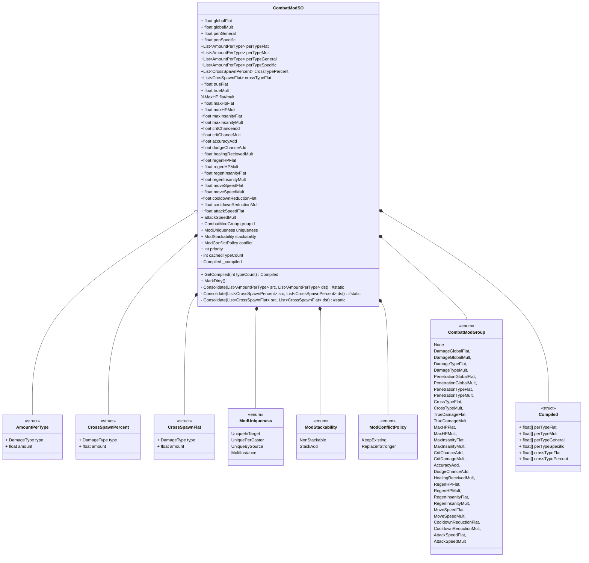

# CombatModSO

```mermaid
classDiagram

class AmountPerType{
<<struct>>
+ DamageType type
+ float amount
}

class CrossSpawnPercent{
<<struct>>
+ DamageType type
+ float amount
}

class CrossSpawnFlat{
<<struct>>
+ DamageType type
+ float amount
}

class ModUniqueness{
<<enum>>
UniqueInTarget
UniquePerCaster
UniqueBySource
MultiInstance
}

class ModStackability{
<<enum>>
NonStackable
StackAdd
}

class ModConflictPolicy{
<<enum>>
KeepExisting,
ReplaceIfStronger
}

class CombatModGroup{

    <<enum>>

    None
    %%      Global Damage

    DamageGlobalFlat,
    DamageGlobalMult,

    %%      Damage By Type

    DamageTypeFlat,
    DamageTypeMult,

    %%     Penetration (Global)

    PenetrationGlobalFlat,
    PenetrationGlobalMult,

    %%     Penetration By Type

    PenetrationTypeFlat,
    PenetrationTypeMult,

    %%          Cross-Type

    CrossTypeFlat,
    CrossTypeMult,

    %%       True Damage Mods

    TrueDamageFlat,
    TrueDamageMult,

    %% Vitalidade / Sanidade

    MaxHPFlat,
    MaxHPMult,
    MaxInsanityFlat,
    MaxInsanityMult,

    %% Ofensivo

    CritChanceAdd,       
    CritDamageMult,       
    AccuracyAdd,         

    %% Defesa

    DodgeChanceAdd,
    HealingReceivedMult,

    %% Regeneração

    RegenHPFlat,
    RegenHPMult,
    RegenInsanityFlat,
    RegenInsanityMult,

    %%                         Mobilidade / Tempo

    MoveSpeedFlat,
    MoveSpeedMult,
    CooldownReductionFlat,
	CooldownReductionMult,

    %% (Tempo real somente)
    
    AttackSpeedFlat,
    AttackSpeedMult
}

class CombatModSO{
%% Global (Afeta todos os tipos)
+ float globalFlat
+ float globalMult
+ float penGeneral
+ float penSpecific
  
%% Per type

+List~AmountPerType~ perTypeFlat
+List~AmountPerType~ perTypeMult
+List~AmountPerType~ perTypeGeneral
+List~AmountPerType~ perTypeSpecific

%% CrossType

+List~CrossSpawnPercent~ crossTypePercent
+List~CrosSpawnFlat~ crossTypeFlat

%% TrueDamage

+ float trueFlat
+ float trueMult

%% Atributos Base/ Utilidade

%MaxHP flat/mult

+ float maxHpFlat
+ float maxHPMult
  
%% max Insanity flat/mult

+float maxInsanityFlat
+float maxInsanityMult

%% crit chance add/mult

+float critChanceadd
+float critChanceMult

%% accuracy/dodge chance add

+float accuracyAdd
+float dodgeChanceAdd

%% Healing

+ float healingRecievedMult

%% ticks de cura  

+float regenHPFlat

+ float regenHPMult
  
%% ticks de insanidade

+ float regenInsanityFlat
+float regenInsanityMult

%% Mobilidade/tempo
+ float moveSpeedFlat
+ float moveSpeedMult
+float cooldownReductionFlat
+ float cooldownReductionMult

%% Attack Speed (somente tempo real)  
+ float attackSpeedFlat
+ attackSpeedMult

%% Empilhamento Unicidade

+ CombatModGroup groupId
+ ModUniqueness uniqueness
+ ModStackability stackability
+ ModConflictPolicy conflict
+ int priority
- int cachedTypeCount
- Compiled _compiled
+ GetCompiled(int typeCount) Compiled
+ MarkDirty()
- Consolidate(List~AmountPerType~ src, List~AmountPerType~ dst)#static
- Consolidate(List~CrossSpawnPercent~ src, List~CrossSpawnPercent~ dst)#static
- Consolidate(List~CrossSpawnFlat~ src, List~CrossSpawnFlat~ dst)#static
}
CombatModSO o--AmountPerType
CombatModSO *--CrossSpawnPercent
CombatModSO *--CrossSpawnFlat
CombatModSO *--ModUniqueness
CombatModSO *--ModStackability
CombatModSO *--ModConflictPolicy
CombatModSO *--CombatModGroup
CombatModSO *--Compiled

class Compiled{
<<struct>>
+ float[] perTypeFlat
+ float[] perTypeMult
+ float[] perTypeGeneral
+ float[] perTypeSpecific
+ float[] crossTypeFlat
+ float[] crossTypePercent
}


```