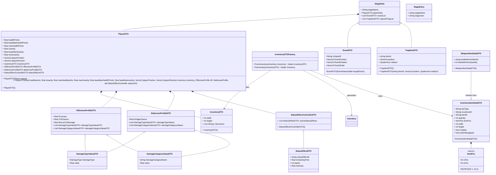
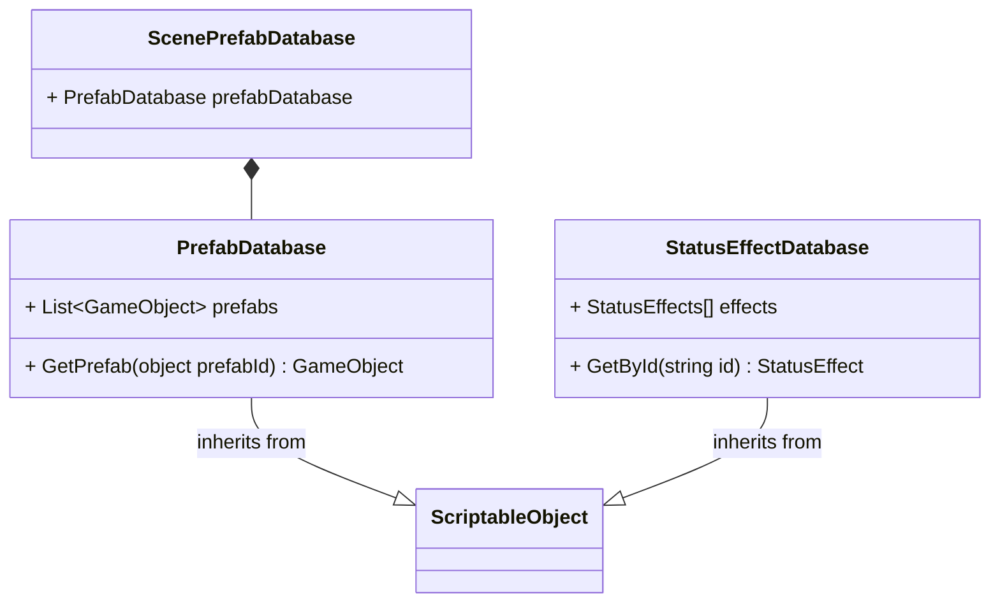

# DTOs

```mermaid
classDiagram

class DamageCategoryValueDTO{
+string DamageCategoryName
+float value
}

class DamageTypeValueDTO{
+DamageType DamageType
+float value
}

class DefensiveProfileDTO{
+float DodgeChance
+List~DamageTypeValueDTO~ damageTypeValues
+List~DamageCategoryValuesDTO~ damageCategoryValues
}

DefensiveProfileDTO o-- DamageTypeValueDTO
DefensiveProfileDTO o-- DamageCategoryValueDTO

class EventDTO{
+String UniqueID
+Vector3 EventPosition
+Vector3 EventRotation
+Vector3 EventScale
+EventDTO(EventInteractable texgetEvent)
}

class InventoryDTO{
+ int width
+ int height
+ List~String~ itemJsons
+ InventoryDTO() 
}

class InventoryDTOFactory{
	+FromInventory(Inventory inventory) #static InventoryDTO
	+ToInventory(InventoryDTO)#static Inventory
}

InventoryDTOFactory --> InventoryDTO : generates
InventoryDTOFactory --> Inventory : generates
InventoryDTOFactory --> InventoryItemDataDTO : uses 

class InventoryItemDataDTO{
+ String dtoType
+ String inventoryID
+ String itemID
+ int quantity
+ ItemPos itemPos
+ int width
+ int height
+ bool rotated
+ bool isItemEquipped
+InventoryItemDataDTO()
}

class ItemPos{
<<struct>>
	+int xPos
	+int yPos
	+ItemPos(int x, int y)
}

InventoryItemDataDTO *-- ItemPos

class OffensiveProfileDTO{
+ float Accuracy
+ float CritChance
+ float BonusCritDamage
+ List~DamageTypeValueDTO~ damageTypeValueDTO
+ List~DamageCategoryValueDTO~ damageCategoryValueDTO
}

OffensiveProfileDTO o-- DamageTypeValueDTO
OffensiveProfileDTO o-- DamageCategoryValueDTO

class PlayerDTO{
+ float healthPoints
+ float baseMaxHealthPoints
+ float maxHealthPoints
+ float insanity
+ float baseMaxInsanity
+ float maxInsanity
+ Vector3 playerPosition
+ Vector2 playerDirection
+ InventoryDTO inventoryDTO
+ OffensiveProfileDTO offensiveProfileDTO
+ DefensiveProfileDTO defensiveProfileDTO
+ StatusEffectControllerDTO statusEffectsDTO
+ PlayerDTO(Player player)
+ PlayerDTO(float healthpoints, float insanity, float maxHealthpoints, float maxInsanity, float baseMaxHealthPoints, float baseMaxInsanity, Vector3 playerPosition, Vector2 playerDirection,Inventory inventory, OffensiveProfile off, DefensiveProfile def,StatusEffectController statusCtrl)
+ PlayerDTO()
}

PlayerDTO *-- InventoryDTO
PlayerDTO *-- OffensiveProfileDTO
PlayerDTO *-- DefensiveProfileDTO
PlayerDTO *-- StatusEffectControllerDTO

class StageData{
+ String stageName
+ PlayerDTO playerData
+ List~EventDTO~ eventList
+ List~TrapItemDTO~ placedTrapList
}

StageData *-- PlayerDTO
StageData o-- EventDTO
StageData o-- TrapItemDTO

class StageEntry{
+ string stageName
+ string stageJson
}


class StatusEffectControllerDTO{
+ List~StatusEffectDTO~ activeStatusEffects
+ StatusEffectsControllerDTO()
}

StatusEffectControllerDTO o-- StatusEffectDTO

class StatusEffectDTO{
+ string statusEffectId
+ float remainingTime
+ int stacks
+ float intensity
}

class TrapItemDTO{
+ string itemId
+ Vector3 position
+ Quaternion rotation
+ TrapItemDTO()
+ TrapItemDTO(string itemId, Vector3 position, Quaternion rotation)
}

class WeaponItemDataDTO{
+ string loadedAmmoItemId
+ int loadedAmmoQuantity
+ WeaponItemDataDTO()
}

WeaponItemDataDTO --|> InventoryItemDataDTO : inherits from

```
# Databases

```mermaid
classDiagram

class PrefabDatabase{
+ List~GameObject~ prefabs
+ GetPrefab(object prefabId) GameObject
}

PrefabDatabase --|> ScriptableObject : inherits from

class ScenePrefabDatabase{
+ PrefabDatabase prefabDatabase
}

ScenePrefabDatabase *-- PrefabDatabase

class StatusEffectDatabase{
+ StatusEffects[] effects
+ GetById(string id) StatusEffect
}

StatusEffectDatabase --|> ScriptableObject : inherits from

```