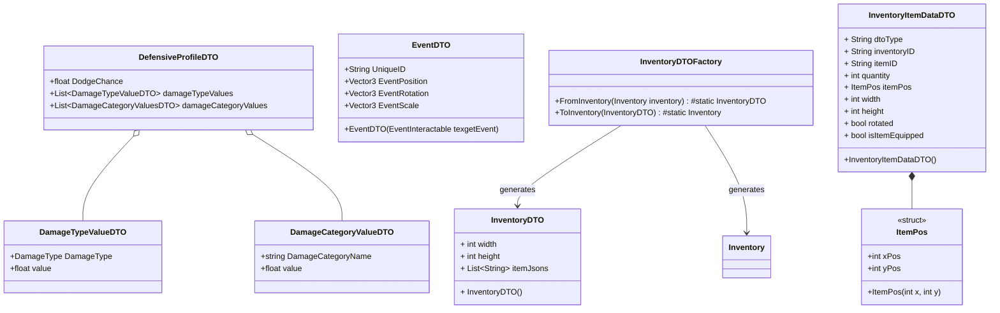

# DTOs

```mermaid
classDiagram

class DamageCategoryValueDTO{
+string DamageCategoryName
+float value
}

class DamageTypeValueDTO{
+DamageType DamageType
+float value
}

class DefensiveProfileDTO{
+float DodgeChance
+List~DamageTypeValueDTO~ damageTypeValues
+List~DamageCategoryValuesDTO~ damageCategoryValues
}

DefensiveProfileDTO o-- DamageTypeValueDTO
DefensiveProfileDTO o-- DamageCategoryValueDTO

class EventDTO{
+String UniqueID
+Vector3 EventPosition
+Vector3 EventRotation
+Vector3 EventScale
+EventDTO(EventInteractable texgetEvent)
}

class InventoryDTO{
+ int width
+ int height
+ List~String~ itemJsons
+ InventoryDTO() 
}

class InventoryDTOFactory{
	+FromInventory(Inventory inventory) #static InventoryDTO
	+ToInventory(InventoryDTO)#static Inventory
}

InventoryDTOFactory --> InventoryDTO : generates
InventoryDTOFactory --> Inventory : generates

class InventoryItemDataDTO{
+ String dtoType
+ String inventoryID
+ String itemID
+ int quantity
+ ItemPos itemPos
+ int width
+ int height
+ bool rotated
+ bool isItemEquipped
+InventoryItemDataDTO()
}

class ItemPos{
<<struct>>
	+int xPos
	+int yPos
	+ItemPos(int x, int y)
}

InventoryItemDataDTO *-- ItemPos

```
# Databases