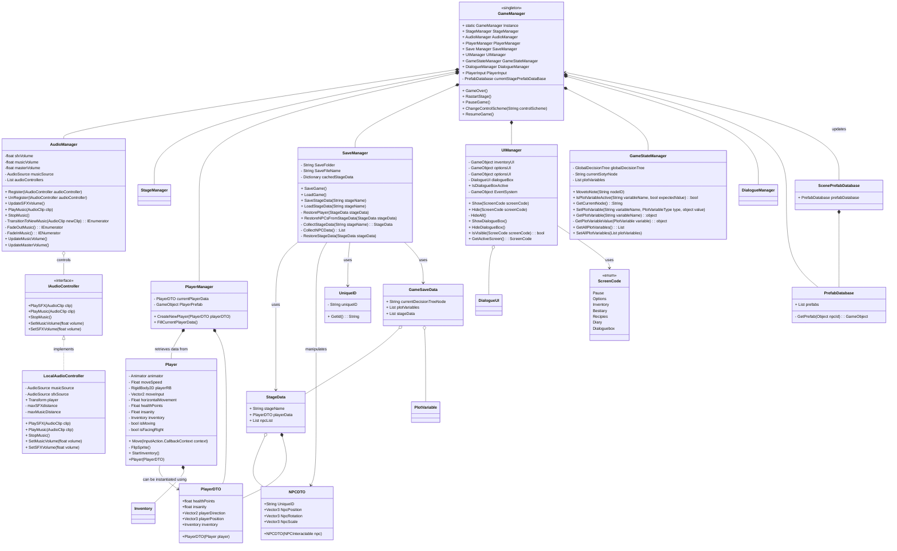

```mermaid
classDiagram

class IAudioController{
		<<interface>>
        +PlaySFX(AudioClip clip)
	    +PlayMusic(AudioClip clip)
	    +StopMusic()
	    +SetMusicVolume(float volume)
	    +SetSFXVolume(float volume)
        }

class LocalAudioController{
        - AudioSource musicSource
        - AudioSource sfxSource
        + Transform player
        - maxSFXdistance
        - maxMusicDistance
        + PlaySFX(AudioClip clip)
        + PlayMusic(AudioClip clip)
        + StopMusic()
        + SetMusicVolume(float volume)
        + SetSFXVolume(float volume)
}
IAudioController <|.. LocalAudioController: implements

class NPCDTO{
	+String UniqueID 
	+Vector3 NpcPosition  
	+Vector3 NpcRotation
	+Vector3 NpcScale
	+NPCDTO(NPCInteractable npc)
}

class PlayerDTO{
	+float healthPoints
	+float insanity
	+Vector2 playerDirection
	+Vector3 playerPosition
	+Inventory inventory
	+PlayerDTO(Player player)
}

class PrefabDatabase{
	+ List<GameObject> prefabs
	- GetPrefab(Object npcId): GameObject
}
class ScenePrefabDatabase{
	+ PrefabDatabase prefabDatabase
}

ScenePrefabDatabase *-- PrefabDatabase

class StageData{
	+ String stageName
	+ PlayerDTO playerData
	+ List<NPCDTO> npcList
}

StageData o--NPCDTO
StageData *--PlayerDTO

class UniqueID{
	- String uniqueID
	+ GetId(): String
}
class AudioManager{
	-float sfxVolume
	-float musicVolume
	-float masterVolume
	- AudioSource musicSource
	- List<IAudioController> audioControllers
	+ Register(IAudioController audioController)
	+ UnRegister(IAudioController audioController)
	+ UpdateSFXVolume()
	+ PlayMusic(AudioClip clip)
	+ StopMusic()
	- TransitionToNewMusic(AudioClip newClip): IEnumerator
	- FadeOutMusic(): IEnumerator
	- FadeInMusic(): IENumerator
	+ UpdateMusicVolume()
	+ UpdateMasterVolume()
}

AudioManager o-- IAudioController: controls

class GameManager{
 <<singleton>>
 + static GameManager Instance
 + StageManager StageManager
 + AudioManager AudioManager
 + PlayerManager PlayerManager
 + Save Manager SaveManager
 + UIManager UIManager
 + GameStateManager GameStateManager
 + DialogueManager DialogueManager
 + PlayerInput PlayerInput
 - PrefabDatabase currentStagePrefabDataBase
 + GameOver()
 + RastartStage()
 + PauseGame()
 + ChangeControlScheme(String controlScheme)
 + ResumeGame()
}

GameManager *-- AudioManager
GameManager *-- StageManager
GameManager *-- PlayerManager
GameManager *-- SaveManager
GameManager *-- UIManager
GameManager *-- GameStateManager
GameManager *-- DialogueManager
GameManager *-- PrefabDatabase
GameManager <-- ScenePrefabDatabase: updates

class GameSaveData{
+ String currentDecisionTreeNode
+ List<PlotVariable> plotVariables
+ List<StageData> stageData
}
GameSaveData o-- StageData
GameSaveData o-- PlotVariable

class GameStateManager{
- GlobalDecisionTree globalDecisionTree
- String currentSotyrNode
- List<PlotVariables> plotVariables
+ MovetoNote(String nodeID)
+ IsPlotVariableActive(String variableName, bool expectedValue):bool
+ GetCurrentNode():String
+ SetPlotVariable(String variableName, PlotVariableType type, object value)
+ GetPlotVariable(String variableName):object
- GetPlotVariableValue(PlotVariable variable): object
+ GetAllPlotVariables(): List<PlotVariable> 
+ SetAllPlotVariables(List<PlotVariable> plotVariables)
}

class PlayerManager{
- PlayerDTO currentPlayerData
- GameObject PlayerPrefab
+ CreateNewPlayer(PlayerDTO playerDTO) 
+ FillCurrentPlayerData()
}

PlayerManager *-- Player: retrieves data from
PlayerManager *-- PlayerDTO 

class Player{
- Animator animator
- Float moveSpeed
- RigidBody2D playerRB
- Vector2 moveInput
- Float horizontalMovement
- Float healthPoints
- Float insanity 
- Inventory inventory
- bool isMoving
- bool isFacingRight
+ Move(InputAction.CallbackContext context)
- FlipSprite()
+ StartInventory() 
+Player(PlayerDTO)
}

Player --> PlayerDTO: can be instantiated using
Player *-- Inventory

class SaveManager{
- String SaveFolder
- String SaveFileName
- Dictionary<String,StageData> cachedStageData
+ SaveGame()
+ LoadGame()
+ SaveStageData(String stageName)
+ LoadStageData(String stageName)
- RestorePlayer(StageData stageData)
+ RestoreNPCsFromStageData(StageData stageData)
- CollectStageData(String stageName): StageData
- CollectNPCData():List<NPCDTO>
- RestoreStageData(StageData stageData)
}

SaveManager  --> StageData : uses
SaveManager --> NPCDTO : manipulates
SaveManager --> UniqueID : uses
SaveManager --> GameSaveData: uses

class ScreenCode{
<<enum>>
 Pause
 Options
 Inventory
 Bestiary
 Recipies
 Diary
 Dialoguebox
}

class UIManager{
- GameObject inventoryUI
- GameObject optionsUI
- GameObject optionsUI
- DialogueUI dialogueBox
+ IsDialogueBoxActive
- GameObject EventSystem
+ Show(ScreenCode screenCode)
+ Hide(ScreenCode screenCode)
- HideAll()
+ ShowDialogueBox()
+ HideDialogueBox()
+ IsVisible(ScreeCode screenCode): bool
+ GetActiveScreen(): ScreenCode
}

UIManager o-- DialogueUI
UIManager --> ScreenCode : uses

```

