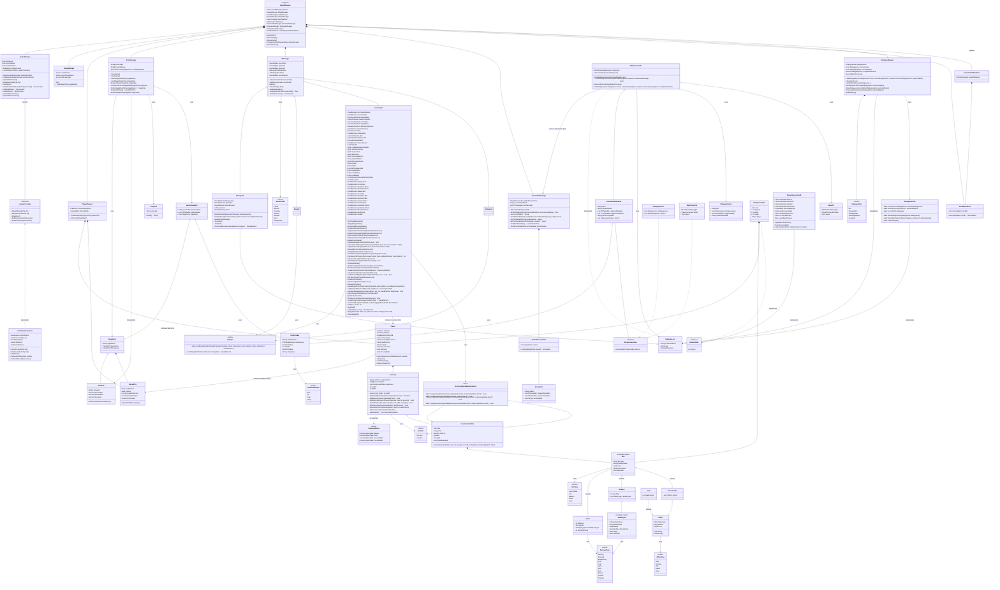

```mermaid
classDiagram

class IAudioController{
		<<interface>>
        +PlaySFX(AudioClip clip)
	    +PlayMusic(AudioClip clip)
	    +StopMusic()
	    +SetMusicVolume(float volume)
	    +SetSFXVolume(float volume)
        }

class LocalAudioController{
        - AudioSource musicSource
        - AudioSource sfxSource
        + Transform player
        - maxSFXdistance
        - maxMusicDistance
        + PlaySFX(AudioClip clip)
        + PlayMusic(AudioClip clip)
        + StopMusic()
        + SetMusicVolume(float volume)
        + SetSFXVolume(float volume)
}
IAudioController <|.. LocalAudioController: implements

class NPCDTO{
	+String UniqueID 
	+Vector3 NpcPosition  
	+Vector3 NpcRotation
	+Vector3 NpcScale
	+NPCDTO(NPCInteractable npc)
}

class PlayerDTO{
	+float healthPoints
	+float insanity
	+Vector2 playerDirection
	+Vector3 playerPosition
	+Inventory inventory
	+PlayerDTO(Player player)
}

class PrefabDatabase{
	+ List~GameObject~ prefabs
	- GetPrefab(Object npcId): GameObject
}
class ScenePrefabDatabase{
	+ PrefabDatabase prefabDatabase
}

ScenePrefabDatabase *-- PrefabDatabase

class StageData{
	+ String stageName
	+ PlayerDTO playerData
	+ List~NPCDTO~ npcList
}

StageData o--NPCDTO
StageData *--PlayerDTO

class UniqueID{
	- String uniqueID
	+ GetId(): String
}
class AudioManager{
	-float sfxVolume
	-float musicVolume
	-float masterVolume
	- AudioSource musicSource
	- List~IAudioController~ audioControllers
	+ Register(IAudioController audioController)
	+ UnRegister(IAudioController audioController)
	+ UpdateSFXVolume()
	+ PlayMusic(AudioClip clip)
	+ StopMusic()
	- TransitionToNewMusic(AudioClip newClip): IEnumerator
	- FadeOutMusic(): IEnumerator
	- FadeInMusic(): IENumerator
	+ UpdateMusicVolume()
	+ UpdateMasterVolume()
}

AudioManager o-- IAudioController: controls

class GameManager{
 <<singleton>>
 + static GameManager Instance
 + StageManager StageManager
 + AudioManager AudioManager
 + PlayerManager PlayerManager
 + Save Manager SaveManager
 + UIManager UIManager
 + GameStateManager GameStateManager
 + DialogueManager DialogueManager
 + PlayerInput PlayerInput
 - PrefabDatabase currentStagePrefabDataBase
 + GameOver()
 + RastartStage()
 + PauseGame()
 + ChangeControlScheme(String controlScheme)
 + ResumeGame()
}

GameManager *-- AudioManager
GameManager *-- StageManager
GameManager *-- PlayerManager
GameManager *-- SaveManager
GameManager *-- UIManager
GameManager *-- GameStateManager
GameManager *-- DialogueManager
GameManager *-- PrefabDatabase
GameManager <-- ScenePrefabDatabase: updates

class GameSaveData{
+ String currentDecisionTreeNode
+ List~PlotVariable~ plotVariables
+ List~StageData~ stageData
}
GameSaveData o-- StageData
GameSaveData o-- PlotVariable

class GameStateManager{
- GlobalDecisionTree globalDecisionTree
- String currentSotyrNode
- List~PlotVariables~ plotVariables
+ MovetoNote(String nodeID)
+ IsPlotVariableActive(String variableName, bool expectedValue):bool
+ GetCurrentNode():String
+ SetPlotVariable(String variableName, PlotVariableType type, object value)
+ GetPlotVariable(String variableName):object
- GetPlotVariableValue(PlotVariable variable): object
+ GetAllPlotVariables(): List~PlotVariable~ 
+ SetAllPlotVariables(List~PlotVariable~ plotVariables)
}

GameStateManager *-- GlobalDecisionTree

class PlayerManager{
- PlayerDTO currentPlayerData
- GameObject PlayerPrefab
+ CreateNewPlayer(PlayerDTO playerDTO) 
+ FillCurrentPlayerData()
}

PlayerManager *-- Player: retrieves data from
PlayerManager *-- PlayerDTO 

class Player{
- Animator animator
- Float moveSpeed
- RigidBody2D playerRB
- Vector2 moveInput
- Float horizontalMovement
- Float healthPoints
- Float insanity 
- Inventory inventory
- bool isMoving
- bool isFacingRight
+ Move(InputAction.CallbackContext context)
- FlipSprite()
+ StartInventory() 
+Player(PlayerDTO)
}

Player --> PlayerDTO: can be instantiated using
Player *-- Inventory

class SaveManager{
- String SaveFolder
- String SaveFileName
- Dictionary~String,StageData~ cachedStageData
+ SaveGame()
+ LoadGame()
+ SaveStageData(String stageName)
+ LoadStageData(String stageName)
- RestorePlayer(StageData stageData)
+ RestoreNPCsFromStageData(StageData stageData)
- CollectStageData(String stageName): StageData
- CollectNPCData():List~NPCDTO~
- RestoreStageData(StageData stageData)
}

SaveManager  --> StageData : uses
SaveManager --> NPCDTO : manipulates
SaveManager --> UniqueID : uses
SaveManager --> GameSaveData: uses

class StageManager{
- Scene currentScene
- String currentSceneName
- int currentSceneIndex
- Init()
+ LoadStage(String stageName)
}

class ScreenCode{
<<enum>>
 Pause
 Options
 Inventory
 Bestiary
 Recipies
 Diary
 Dialoguebox
}

class UIManager{
- GameObject inventoryUI
- GameObject optionsUI
- GameObject optionsUI
- DialogueUI dialogueBox
+ IsDialogueBoxActive
- GameObject EventSystem
+ Show(ScreenCode screenCode)
+ Hide(ScreenCode screenCode)
- HideAll()
+ ShowDialogueBox()
+ HideDialogueBox()
+ IsVisible(ScreeCode screenCode): bool
+ GetActiveScreen(): ScreenCode
}

UIManager o-- DialogueUI
UIManager --> ScreenCode : uses
UIManager o-- DiaryUI
UIManager o-- InventoryUI
UIManager o-- OptionsUI

class DialogueEvents{
+ static event Action~DialogueLine~ OnShowDialogueLine
+ static event Action~List~String~~ OnShowOptions
+ static event OnClearDialogue
+ static ShowDialogueLine(DialogueLine dialogueLine)
+ static ShowOptions(List~String~ Options, Action~int~ optionSelected)
+ static ClearDialogue()
}

class DialogueLine{
 + String characterName
 + String text
 + Texture2D portrait
}

DialogueEvents --> DialogueLine : manipulates

class DialogueState{
<<enum>>
Idle
ShowingText
AwaitingInput
ShowingOptions
Complete
}

class DialogueManager{
+ DialogueState DialogueState
+ List~DialogueLine~ currentLines
+ List~DialogueOption~ currentOptions
- Action~DialogueOption~ onOptionSelected
- bool isOptionProcessed
+ StartDialogue(List~DialogueLine~ lines, List~DialogueOption~ options, Action~DialogueOption~ optionCallback)
+ ShowNextLine()
- HandleTextAdvance(DialogueLine _)
- HandleOptionSelected(DialogueOption selectedOption)
- ShowDialogueLinesForOption(DialogueOption selectedOption)
- ProcessOptionActions(DialogueOption selectedOption)
- EndDialogue() 
}

DialogueManager *-- DialogueState
DialogueManager --> DialogueLine : manipulates
DialogueManager --> DialogueEvents : uses

class DialogueOption{
+ String text
+ List~DialogueLines~ dialogueLines
+ List~PlotVariable~ triggeredFlags
+ String nextStoryNodeId 
}

class GlobalDecisionTree{
+ List~StoryNode~ nodes
+ GetNodeById(String nodeId): StoryNode
}

GlobalDecisionTree o-- StoryNode

class StoryNode{
+ String nodeId
+ List~PlotVariable~ triggeredVariables
+ List~PlotVariable~ requiredVariables
+ List~String~ nextNodeIds
}

class InteractiveResponse{
+ String label
+ String requiredNode
+ List~PlotVariable~ requiredVariables
+ List ~PlotVariable~ triggeredVariables
+ String nextStoryNodeId
+ List ~IResponseAction~ actions
}

InteractiveResponse o-- PlotVariable
InteractiveResponse o-- IResponseAction


class IResponseAction{
<<Interface>>
+ Execute(NPCInteractable context)
}

class DialogueAction{
+List~DialogueLine~ dialogueLines
+List~DialogueOptions~ options
}

DialogueAction ..|> IResponseAction
MoveToAction ..|> IResponseAction

class MoveToAction{
+NPCInteractable target
+Transform targetPostion
+ float speed
}

class MoveTo{
+NPCInteractable target
+Transform targetPostion
+ float speed
}

class ItemInteractable{
 - Item item
 + int quantity
 + int width
 + int height
 - Player player 
}

ItemInteractable *-- Item
ItemInteractable *-- Player
ItemInteractable ..|> IInteractable : implements

class IInteractable{
<<interface>>
+ Interact()
}

class NPCInteractable{
-List~InteractiveResponse~ responses
- InteractiveResponse lastResponse
- GetValidResponses(GameStateManager gms)
- ProcessResponseActions(InteractiveResponse response, GameStateManager gsm)
+ RecieveMoveCommand(MoveTo move)
+ StartDialogue(List~DialogeLine~ Lines, List~DialogueOption~ options, Action~DalogueOption~ onOptionSelected)
}

NPCInteractable --> GameStateManager : recieves information from
NPCInteractable ..|> IInteractable : implements
NPCInteractable o-- InteractiveResponse
NPCInteractable --> DialogueLine : uses
NPCInteractable --> DialogueOption : uses
NPCInteractable --> MoveTo : uses

class PlotVariableType{
<<enum>>
Bool,
Int,
Float,
String
}

class PlotVariable{
+ String variableName
+ PlotVariableType variableType
+ bool boolValue
+ int intValue
+ float floatValue
+ String stringValue
}

PlotVariable --> PlotVariableType : uses

class PlayerInteraction2D{
+ Vector2 boxSizeVertical
+ Vector2 boxSizeHorizontal
+ float boxDistanceVertical
+ float boxDistanceHorizontal
+ LayerMask interactableLayer
- IInteractable interactable
- Vector2 lastMoveDirection
- Vector2 currentBoxSize
- float currentBoxDistance
- UpdateMoveDirection()
- DetectInteractable()
+ Interact(InputAction.CallbackContext context)  
}

PlayerInteraction2D --> IInteractable : manipulates

class ItemType{
<<enum>>
consumable
relic
weapon
armor
none
}

class Item{
<<scriptable object>>
+ ItemType type
+ String displayName
+ sprite Icon
+ String description
+ bool isKeyItem
}

Item --> ItemType : uses
Item <|-- Armor : extends
Item <|-- Weapon : extends
Item <|-- Consumable : extends

class Armor{
+ int deffense
+ float weight
+ DamageType bonusDeffenseType
+ int bonusDeffense
}

Armor --> DamageType : uses

class DamageType{
<<enum>>
	Piercing
    Slashing
    Bludgeoning
    Fire
    Cold
    Light
    Dark
    Acid
    Poison
    Psychic
    Thunder
}

class Weapon{
+ int baseDmg
+ List~AttackType~ attackTypes
}

Weapon o-- AttackType

class AttackType{
<<scriptable object>>
+ String attackName
+ int bonusDamage
+ dmgPenalty
+ DamageType damageType
+ float range
+ float cooldown
}

AttackType --> DamageType : uses

class Consumable{
	+ List ~Effect~ effects
}

Consumable o-- Effect

class Effect{
+ EffectType Type
+ String Name
+ Sprite Icon
+ virtual Init()
+ virtual Use()

}

Effect --> EffectType : uses

class EffectType{
<<enum>>
	Heal
    Damage
    Buff
    Debuff
    None
}

class Heal{
+ int healAmount 
}

Heal --|> Effect : extends

class DialogueUI{
- VisualElement dialogueArea
- VisualElemento optionBox
- VisualElement optionElement
- Label textLabel
- VisualElement portrait
- HandleShowDialogueLine(DialogueLine dialogueLine)
- HandleShowOption(List~String~options,Action~int~onOptionSelected)
- HandleClearDialogue()
+ ShowSelf()
+ HideSelf()
- CloneVisualElement(VisualElement original) : VisualElement 
}

DialogueUI --> DialogueLine : uses

class InventoryUI{
- VisualElement rootVisualElement
- VisualElement inventoryGrid
- InventoryItemData selectedItem
- VisualTreeAsset navBarTemplate
- InventoryItemData currentItem
- InventoryItemData originalItem
- DamageTypeIcons damageTypeIcons
- ItemStatsIcons itemStatsIcons
- Inventory inventory
- VisualElement floatingItem
- Label itemNameLabel
- Label itemDescriptionLabel
- bool isItemSuspended
- VisualElement selectItemIcon
- Label tipLabel
- Sprite rotateSelectedItemSprite
- Sprite selectItemSprite
- Sprite weaponIcon
- Sprite armorIcon
- Sprite consumableIcon
- String originalTipTest
- Vector2 mousePosition
- Player player
- float slotSize
- bool rightClickHandled
- button equipButton
- button dropButton
- button useButton
- ScrollView itemDescriptionScrollView
- ScrollView stats
- VisualElement weaponArea
- VisualElement armorArea
- VisualElement quickItem1Area
- VisualElement quickItem2Area
- VisualElement weaponBG
- VisualElement armorBG
- VisualElement quickItem1BG
- VisualElement quickItem2BG
- VisualElement weaponVisual
- VisualElement armorVisual
- VisualElement quickItem1Visual
- VisualElement quickItem2Visual
- VisualElement descItemVisual
- VisualElement gridFrame
- VisualElement navBar
- VerifyAndEquipItems()
- HighlightEquipSlots()
- RemoveAllEquipHighlights()
- ClearEquipFrameSelection()
- OnQuickItem2AreaClicked(PointerDownEvent evt)
- OnQuickItem1AreaClicked(PointerDownEvent evt)
- OnArmorAreaClicked(PointerDownEvent evt)
- OnWeaponAreaClicked(PointerDownEvent evt)
- EquipButtonClicked()
- IsItemEquipped(IventoryItemData item):bool
- SetItemVisualInEquipeArea(InventoryItemData item, bool consumable2 = false)
- EquipItem(InventoryItemData item, bool consumable2 = false)
- UnequipItem(InventoryItemData item)
- OnRightClick(PointerDownEvent evt)
- OnGridGeometryChanged(GeometryChangedEvent evt)
- CalculateGridPosition(float mousePosition, float gridStartPosition, float slotSize): int
- OnPointerDown(PointerDownEvent evt)
- IsClickInEquipArea(VisualElement target):bool
- ClearItemDetaisl()
- UpdateItemDetails(InventoryItemData selectedItem)
- ShowitemStatus(InventoryItemData itemData)
- CreateSnapshot(InventoryItemData item):InventoryItemData
- SetupFloatingItem(InventoryItemData item)
- IsCellOccupiedByItem(InventoryItemData item, int x, int y):bool
- OnPointerMove(PointerMoveEvent evt)
- RotateSelectedItem()
- OnPointerUp(PointerUpEvent evt)
- ResetItemPosition()
- HandleEquipFromDrop(InventoryItemData selectedItem, VisualElement targetArea)
- GetEquippedItem(VisualElement equipArea):InventoryItemData
- IsDroppedInEquipArea(PointerUpEvent evt, out VisualElement targetArea):bool
- SetItemSuspendedState(bool isSuspended)
- UpdateUI(List<InventoryItemData> items)
- PlaceItemInGrid(InventoryItemData item):bool
- CreateItemVisual(InventoryItemData item): VisualElement
- CalculateOffsets(int finalWidth, int finalHeight):(float offsetX, float offsetY)
- GCD(int a, int b):int
- ClearGrid()
- GetSlotAt(int x, int y):VisualElement
- HighlightSlots(int xStart, int yStart, int width, int height, bool valid)
- ClearHighlights()
- 
}

DiaryUI --> UIHelper : uses
InventoryUI --> UIHelper : uses
InventoryUI --> Player : retrieves inventory from
OptionsUI --> UIHelper : uses

class UIHelper{
<<static>>
+ statis LoadNavigationBar(VisualTreeAsset template, Action onInventory, Action onDiary, Action onOptions) : VisualElement
+ LoadNavigationBar(VisualTreeAsset template) : VisualElement
}

class Inventory{
	+ EquippedItems equippedItems
	+ bool[][] inventoryGrid
	+ List~IventoryItemData~ itemsData
	+ int Height
	+ int Width
	+ Inventory(int height, int widht)
	+ FindAvailablePosition(InventoryItemData item):? ItemPos
	+ AddItemAuto(IventoryItemData item) : bool
	+ AddItemExplicit(IventoryItemData item, ItemPos position): bool
	+ IsValidPosition(int xStart, int yStart, int width, int height): bool
	+ PlaceItem(InventoryItemData item, ItemPos pos) : bool
	+ MoveItem(InventoryItemData item, ItemPos newPosition)
	+ RemoveItem(InventoryItemData item)
	+ GetAllItems(): List~InventoryItemData~
}

class ItemPos{
<<struct>>
+ int xpos
+ int ypos
}

Inventory --> EquippedItems : Incorporates
Inventory --> ItemPos: uses
Inventory o-- InventoryItemData

class EquippedItems{
<<struct>>
+ InventoryItemData Weapon
+ InventoryItemData Armor
+ InventoryItemData Consumable1
+ InventoryItemData Consumable2
}

class InventoryItemData{
	- Item item
	- int quantity
	- ItemPos itemPos
	- int width
	- int height
	- bool isItemEquipped
	+ InventoryItemData(Item item, int quantity, int width, int height, bool isItemEquiped = false) 
}

InventoryItemData *-- Item

class InventoryItemDataOperations{
<<static>>
+ static CompareItemPositions(InventoryItemData item1, InventoryItemData item2): bool
+ static CompareItemPositions(ItemPos item1, ItemPos item2): bool 
+ static CompareInventoryItemDataContents(InventoryItemData item1, InventoryItemData item2): bool
+ static CompareInventoryItemDataItems(InventoryItemData item1, InventoryItemData item2): bool 
}

InventoryItemDataOperations --> InventoryItemData
InventoryUI --> InventoryItemDataOperations : uses
InventoryItemDataOperations --> ItemPos
```