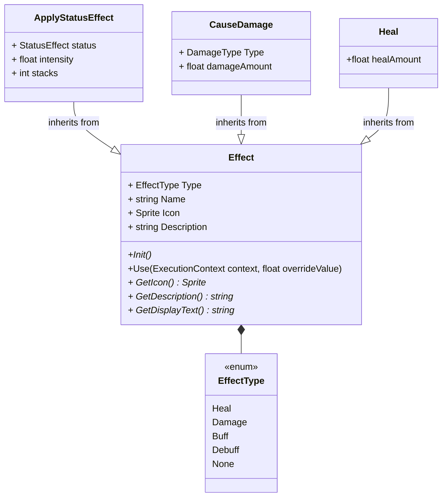

```mermaid
classDiagram

class Effect{
+ EffectType Type
+ string Name
+ Sprite Icon
+ string Description
+Init() *
+Use(ExecutionContext context, float overrideValue)
+ GetIcon() Sprite *
+ GetDescription() string*
+ GetDisplayText() string *
}

Effect *-- EffectType

class EffectType{
<<enum>>
Heal
Damage
Buff
Debuff
None
}

class ApplyStatusEffect{
+ StatusEffect status
+ float intensity
+ int stacks
}


ApplyStatusEffect --|> Effect : inherits from

class CauseDamage{
+ DamageType Type
+ float damageAmount
}

CauseDamage --|> Effect : inherits from
class Heal{
+float healAmount
}

Heal --|> Effect : inherits from

```