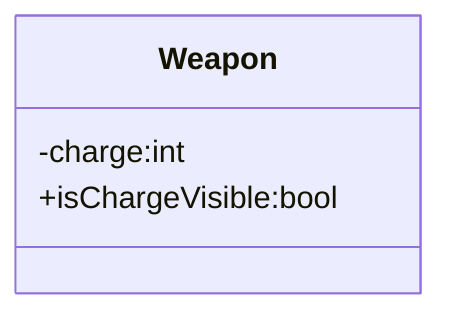

- combinar itens empilháveis arrastando um em cima do outro

- implementar o combine

- item de quest fica separado do inventário

- implementação de baús com inventário secundário?
	- Não para o Vertical Slice, a menos que haja necessidade

Sugestão para implementação de Weapon:

- Weapon não precisa ser dividida em subclasses, pois a implementação da redução de munição é a mesma para todos os tipos de arma, porém, para armas que originalmente não possuem munição, ter esse atributo visível na interface é inconveniente, por isso, criamos um atributo booleano : isChargeVisible

