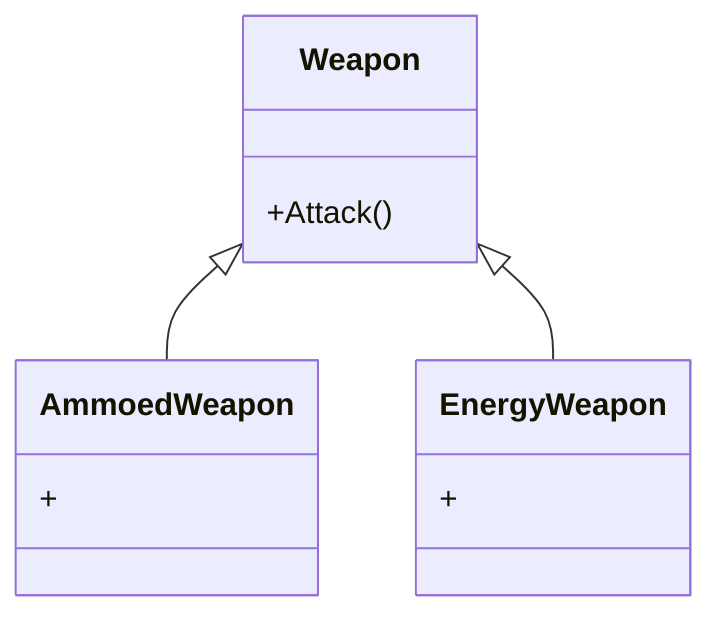

implementar um cap para os itens

[ra]:194

[revolver] :6

[ra]:48 (empilhar munição, só acaba munição na arma)

consumível: bateria int: carga
item: bateria descarregada
bateria carrega e descarrega sempre 100%
bateria quando chega a zero é destruída e adiciona uma bateria descarregada
consumível quando chega a zero é destruído

1.Criar uma classe que mapeia a o tipo de munição e concede a arma o AttackType correto, porque uma mesma munição pode ter efeitos diferentes em armas diferentes

2.Ideia alternativa mais simples: ter munições elementais diferentes de calibres diferentes, você não pode usar munição de gelo de 12 em um rifle, por exemplo, você precisa de munição de gelo de rifle

Criar as munições como seu próprio tipo, e não somente como consumíveis

Munições funcionam como decorators para os attackTypes, se uma arma tiver um atacktype e uma munição ativa, ela vai modificar o attackType

**Ammoed Weapon** -> São armas que possuem algum tipo de munição, a ideia aqui é associar o verbo *reload* com colocar a munição e *recharge* com recarregar uma arma de energia.

**Energy Weapon** -> São armas que usam energia e podem ser recarregadas por baterias ou por estações de energia espalhadas pelo cenário.

